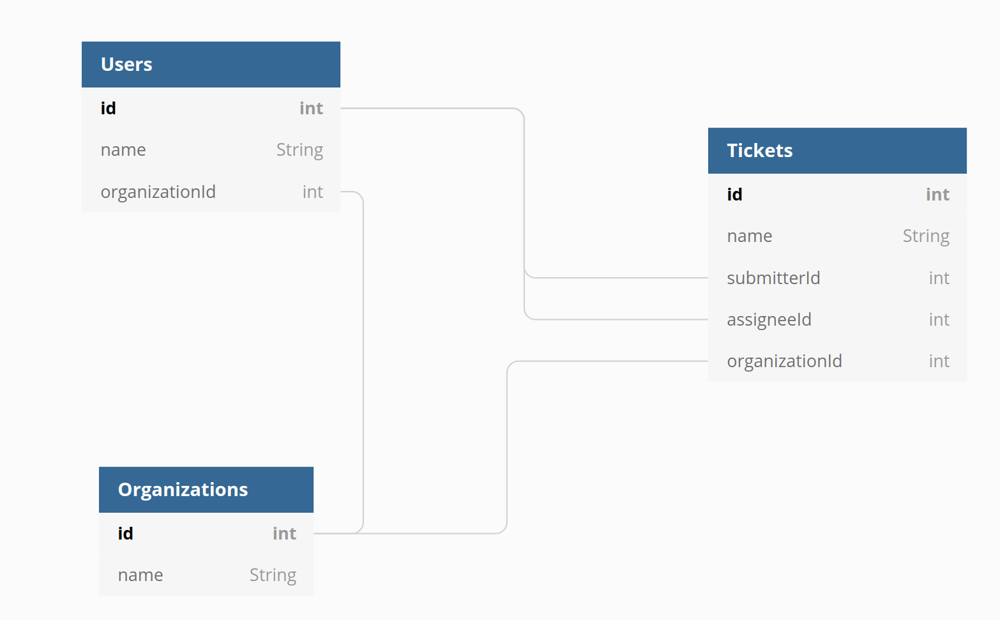
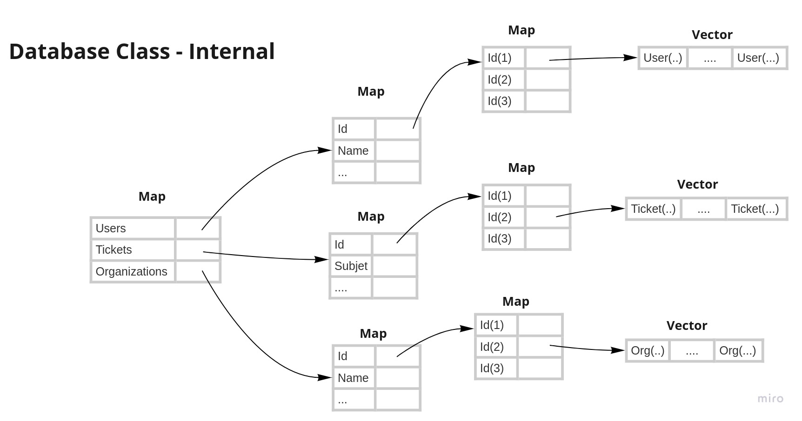
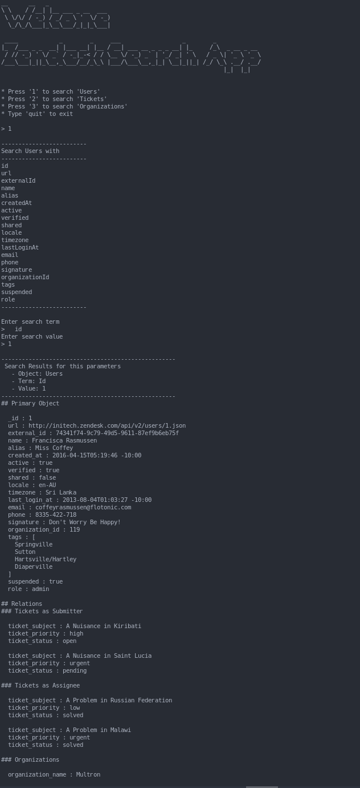

# Zendesk Search App
This repo is to submit my code exercise to Zendesk.
Zendesk describes that it is fine for me to use Public repo for my exercise.

# Assumption
1. For me this is malformed ISO8601 format, `"2016-05-21T11:10:28 -10:00"` but assumed that it is on purpose.
   - There should not be `space` before timezone adjustment, `-10:00`

2. I decided Optional fields myself based on the given data. I assumed that fields having `null` value is optional ones.

   - Users
     - `alias`: Option[Alias],
     - `verified`: Option[Verified],
     - `locale`: Option[Locale],
     - `timezone`: Option[Timezone],
     - `email`: Option[Email],
     - `organizationId`: Option[OrganizationId],

   - Organizations
     - None

   - Tickets
     - `type`: Option[Type],
     - `description`: Option[Description],
     - `assigneeId`: Option[AssigneeId],
     - `organizationId`: Option[OrganizationId],
     - `dueAt`: Option[ZenDateTime],

3. For this statement, `The user should also be able to search for empty values, e.g. where description is empty`.
   In the data, description is nullable value so assumed that only nullable value could searchable with `Empty string value`, which is stated at #2.

4. I assumed that my UX does not have to be the same as the provided sample.
   - I wanted to display the searchable fields for the object users are selected.
   - Screenshot is attached at Appendix

# Approach

## Libraries I used
- [Circe](https://circe.github.io/circe/) to parse Json data files; users.json, tickets.json, and organizations.json
- [Cats](https://typelevel.org/cats/) for general FP type classes like Either.
- [Cats-Effect](https://typelevel.org/cats-effect/) for IO Monad
- [Spec2](https://etorreborre.github.io/specs2/) this is just personal preference. I found that this style is better than scala-test but could be opinionated
- [Scala Check](http://www.scalacheck.org/) for Simple Property Check
- [FastParser](http://www.lihaoyi.com/fastparse/#FastParse2.2.2) to parse Console Input, Using Regex makes code quit hard understand

## Functional Programming
In the job description, FP is desired skill so thought that I could do my best with FP.

Except a few codes almost all codes are pure; I did not use mock for testing.

Exceptions are
1. Read JSON data files
2. Creating Database data structure.
3. Main class.

## Diagrams

### Relationships among object to be used for search

### Data Structure for Database Class
I have used these two Scala class based on [this scala doc](https://docs.scala-lang.org/overviews/collections-2.13/performance-characteristics.html) for `BigO performance`
- Either mutable or immutable HashMap
- Vector

# Development

## Setup Environment
**sometime after running your test from docker the file owner tend to be changed as `root`**

This command will fix the issue

> sudo chown -r $USER:$USER .
>
### Without Docker
1. [Install Open JDK 8u222](https://openjdk.java.net/install/)
2. [Install sbt 1.3.6](https://www.scala-sbt.org/)
2. [Scala 2.13.1](https://www.scala-lang.org/)
4. Execute `Commands` below for either test or execute app

#### Commands

##### Run Test

`sbt clean test`

##### Run App

`sbt clean assembly`

`scala target/scala-2.13/zendesk.jar <optional users data file path> <optional organizations data file path> <optional tickets data file path>`

### With Docker
1. [Install Latest Docker](https://docs.docker.com/v17.12/install/)
2. [Install Docker Compose](https://docs.docker.com/compose/install/)
3. Use docker container, `auto/dev-environment`
4. Execute `Commands** below for either test or execute app

#### Commands

##### Get into Docker Container
`auto/dev-environment`

##### Run Test
`auto/test`

##### Run App
`auto/run <optional users data file path> <optional organizations data file path> <optional tickets data file path>`

## Appendix

### Sample Result

